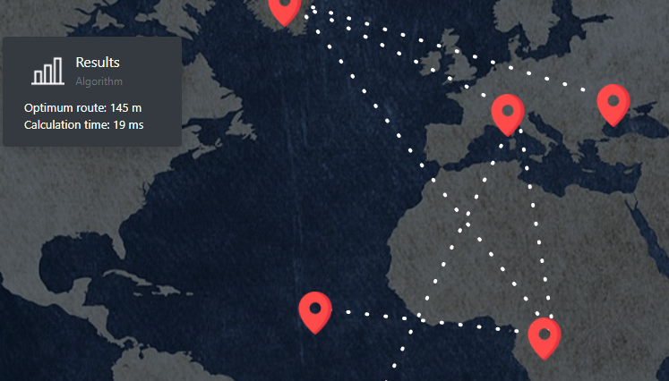

## Flask server for cp project

We only require flask and flask-sijax 



## Running Locally

Make sure you have Python installed

```sh
$ git clone https://github.com/and27/cp_project_aco_arduino
$ cd basic-flask-template
$ pip install -r requirements.txt 
$ python app.py
```

Your app should now be running on [localhost:5000](http://localhost:5000/).
